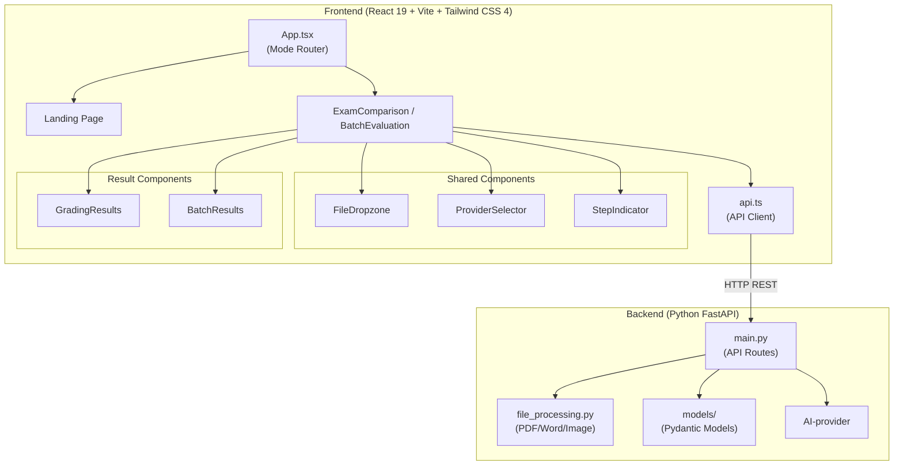
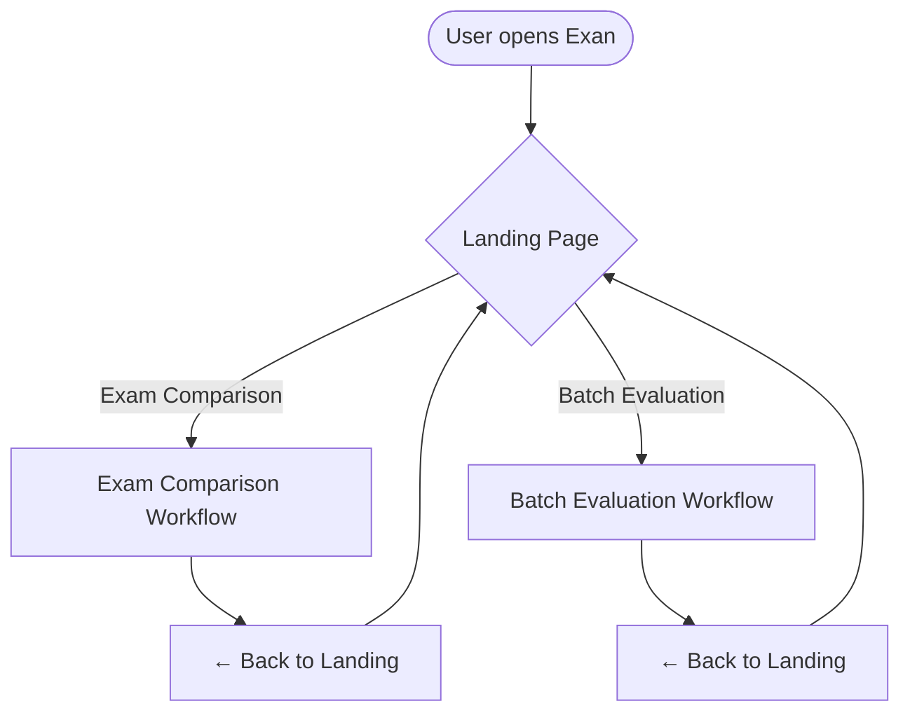
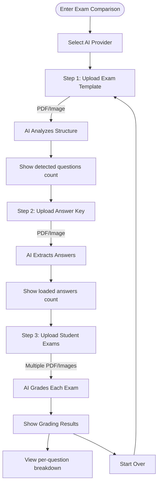
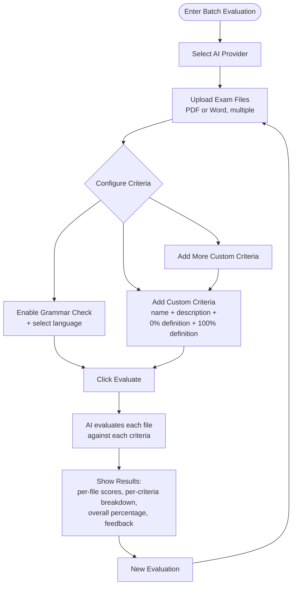
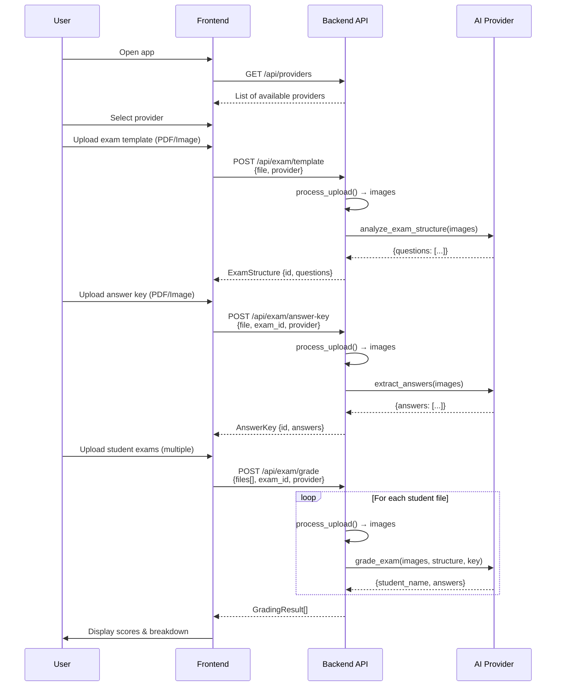
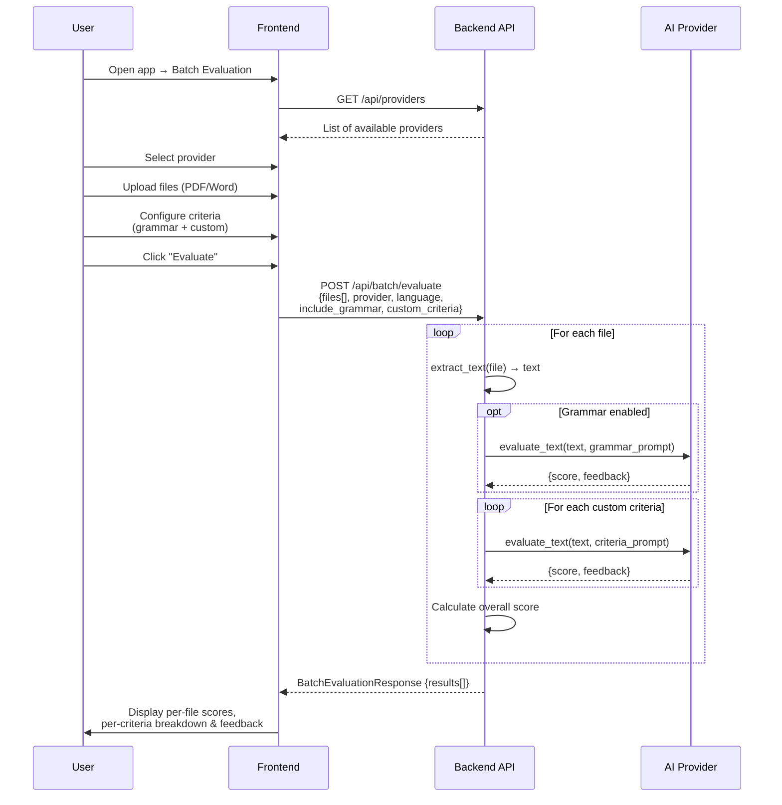
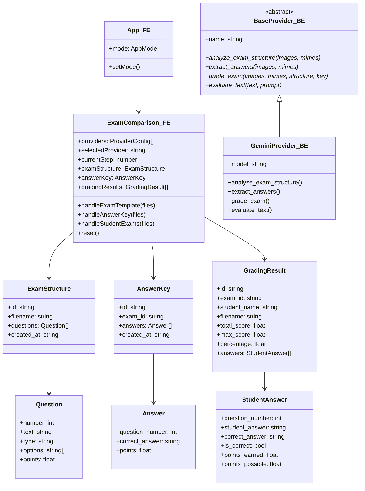
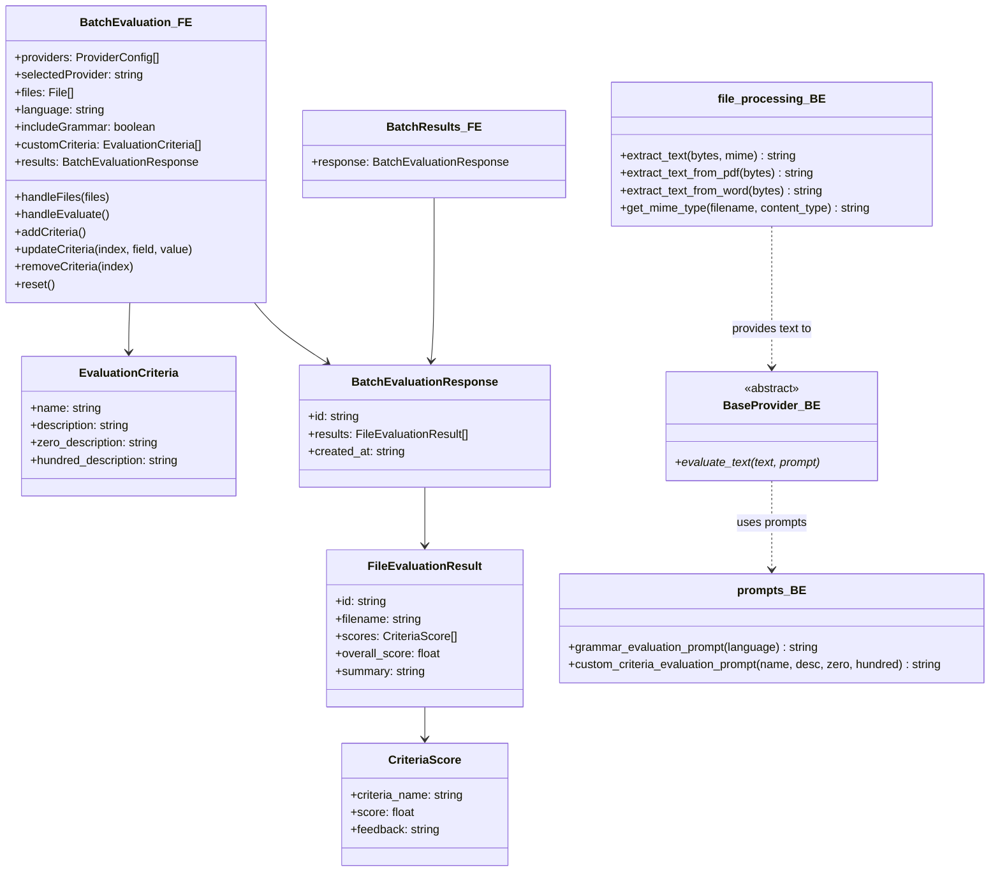
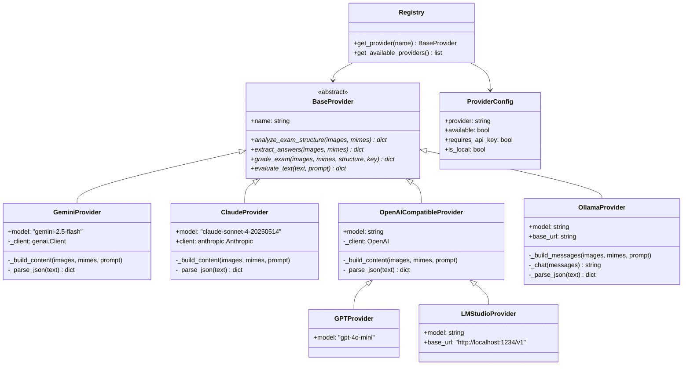

# Architecture Diagrams

This document contains Mermaid diagrams describing the Exan project architecture, workflows, and interactions.

---

## 1. High-Level Component Architecture

---

## 2. User Workflow Diagrams

### 2.1 Landing Page Selection

### 2.2 Exam Comparison Workflow

### 2.3 Batch Evaluation Workflow

---

## 3. Swimlane Diagram — Frontend / Backend Interaction

### 3.1 Exam Comparison Flow

### 3.2 Batch Evaluation Flow

---

## 4. Per-Feature Class Diagrams

### 4.1 Exam Comparison — Models & Classes

### 4.2 Batch Evaluation — Models & Classes

### 4.3 Shared Infrastructure — Provider Registry

