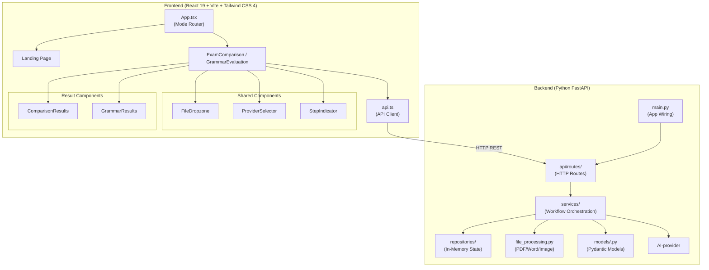
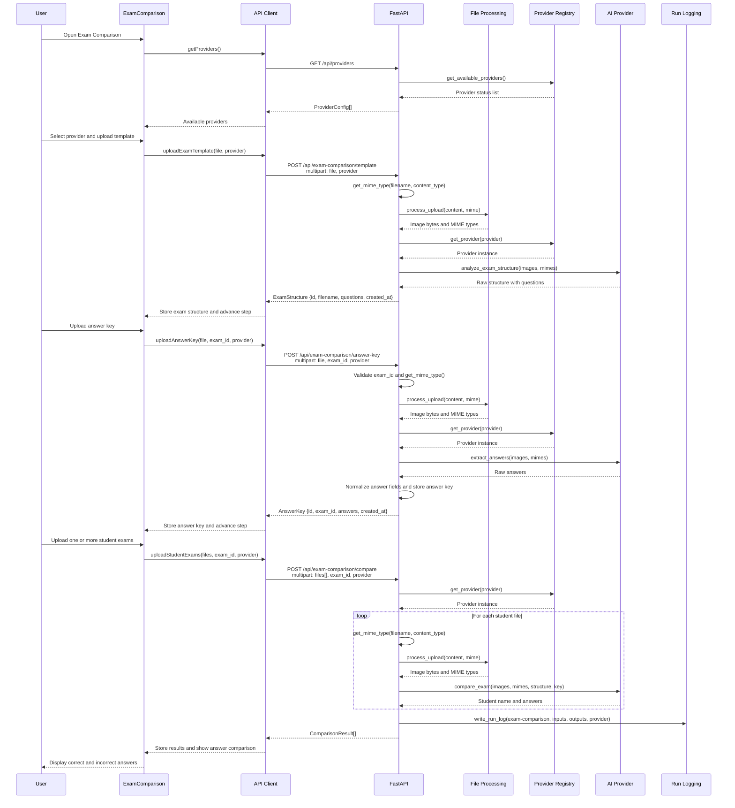
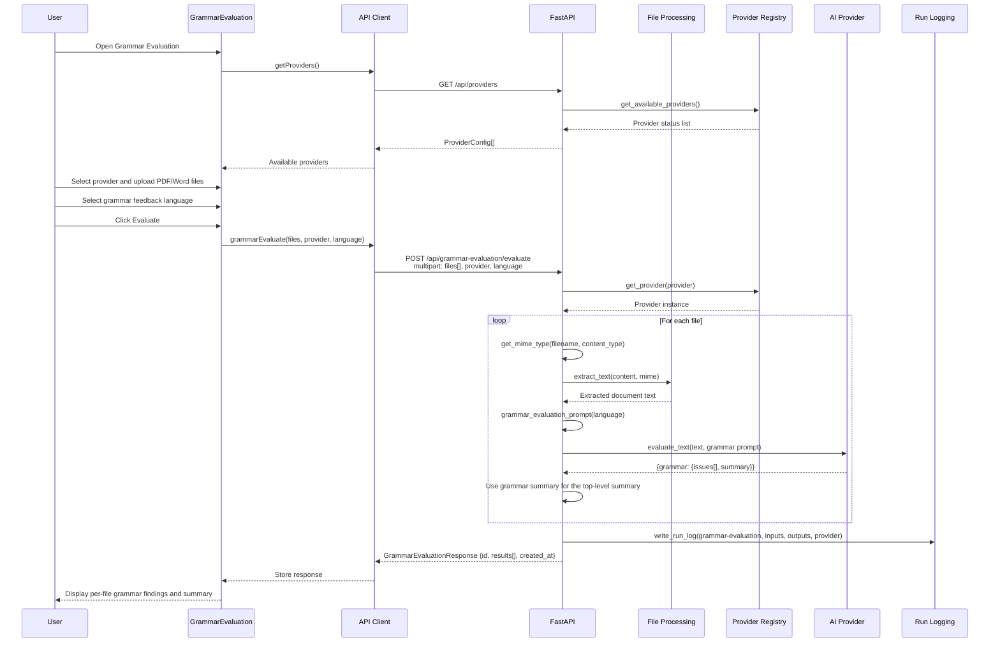
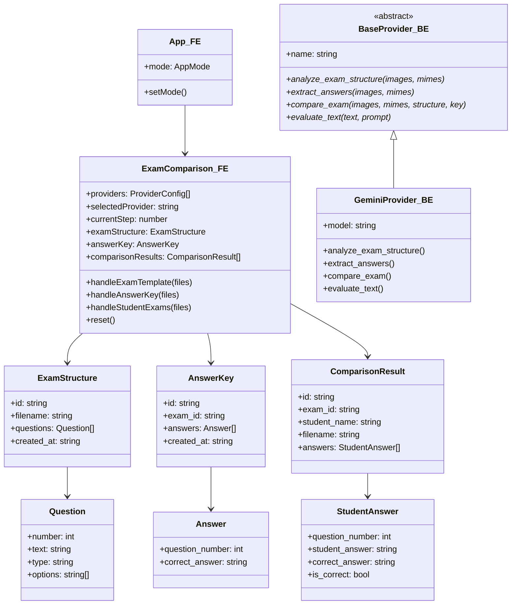
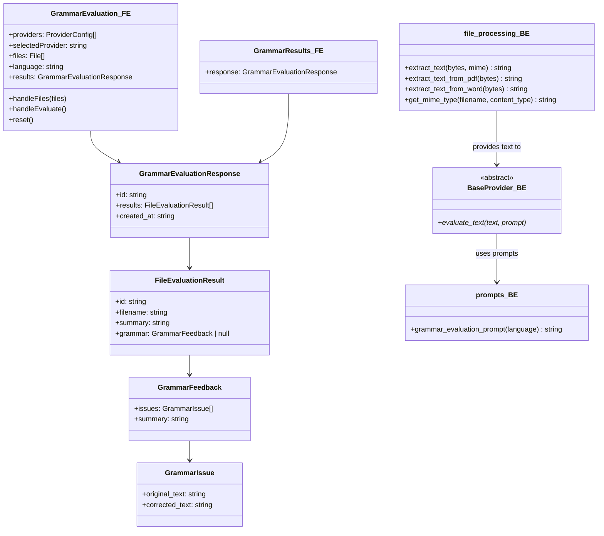

# Exan Architecture

This document is the short architecture index for Exan. It keeps the project purpose, current implementation status, architecture decisions, and links to deeper technical details in one place.

## Table of Contents

- [Purpose](#purpose)
- [Current Status](#current-status)
- [Architecture Options](#architecture-options)
- [Recommended Architecture](#recommended-architecture)
    - [Service boundaries](#service-boundaries)
    - [Request flow](#request-flow)
    - [Provider abstraction](#provider-abstraction)
    - [State and persistence](#state-and-persistence)
    - [Authentication and security](#authentication-and-security)
- [Detailed Architecture Diagrams](#detailed-architecture-diagrams)
    - [High-level component architecture](#1-high-level-component-architecture)
    - [Frontend and backend interaction](#3-swimlane-diagram--frontend--backend-interaction)
    - [Per-feature class diagrams](#4-per-feature-class-diagrams-pending-to-read)

## Purpose

Exan scans exam documents, extracts their structure, and compares student responses with correct answers using AI. The architecture supports both cloud providers and local inference while keeping the frontend workflow consistent across providers.

## Current Status

- The React 19 webapp provides Exam Comparison and Grammar Evaluation workflows.
- The FastAPI inference service owns document processing, workflow orchestration, provider selection, and answer comparison.
- Gemini, Claude, GPT, Ollama, and LM Studio are represented behind a shared provider abstraction.
- Express and MongoDB provide authentication and user storage.
- Exam and answer-key workflow state is currently held in FastAPI process memory.
- Inference endpoints are not yet authenticated, so user ownership and provider-credential isolation are not complete.
- Docker Compose runs the webapp, inference service, auth service, and MongoDB for local deployment.

## Architecture Options

The options and their subtopics are maintained separately so this index remains quick to scan:

- [Architecture options and trade-offs](architecture/ARCHITECTURE_OPTIONS.md): service topology, runtime provider credentials, phone scanning, storage, and deployment choices.
- [Runtime provider, credential, model, and effort selection](PROVIDER_RUNTIME.md): detailed provider-connection alternatives and API contract.
- [Phone scanning integration options](scanning/SCANNING_INTEGRATION_OPTIONS.md): mobile capture and desktop handoff alternatives.
- [First release deployment options](deployment/DEPLOYMENT_OPTIONS.md): hosting platform comparison, container-versus-Kubernetes topology, and infrastructure automation for the beta deployment.

## Recommended Architecture

### Service boundaries

- **Webapp:** React UI, upload workflows, provider selection, and result presentation.
- **Inference:** FastAPI routes, document processing, workflow services, repositories, provider registry, and AI calls.
- **Auth:** Express JWT issuance and identity ownership.
- **Database:** MongoDB user persistence and future durable metadata.
- **Reverse proxy:** nginx routes `/api/auth/*` to `auth-server` and other `/api/*` requests to `inference`.

### Request flow

The browser submits files and workflow settings to FastAPI. FastAPI validates the request, processes files into text or images, resolves a provider through the registry, invokes the model, normalizes the structured result, and returns it to the React workflow. The detailed sequence diagrams below document the current flows.

### Provider abstraction

All providers implement the shared `BaseProvider` contract. The registry exposes provider availability and returns the selected implementation, allowing cloud and local providers to share the same exam-analysis and text-evaluation workflows. Runtime model and credential selection is documented in [PROVIDER_RUNTIME.md](PROVIDER_RUNTIME.md).

### State and persistence

Keep the current in-memory repositories for the single-instance MVP. Before adding multiple inference replicas or durable workflows, move workflow state to a shared persistence layer with explicit user ownership. Temporary uploads and runtime provider connections should have bounded lifetimes and cleanup.

### Authentication and security

Authenticate every inference endpoint using the authenticated Exan user, bind exams and answer keys to that user, and avoid returning raw upstream provider errors. For runtime credentials, use the short-lived server-side provider connection described in [PROVIDER_RUNTIME.md](PROVIDER_RUNTIME.md); never return or log the credential.

## Detailed Architecture Diagrams

The following sections retain the implementation diagrams and are intentionally lower in the document. Use the table of contents for direct navigation.

---

## 1. High-Level Component Architecture

---

## 3. Swimlane Diagram — Frontend / Backend Interaction

### 3.1 Exam Comparison Flow

### 3.2 Grammar Evaluation Flow

---

## 4. Per-Feature Class Diagrams (PENDING TO READ)

Grammar Evaluation is grammar-only; the remaining diagrams describe the active
response contract and shared comparison infrastructure.

### 4.1 Exam Comparison — Models & Classes

### 4.2 Grammar Evaluation — Models & Classes

### 4.3 Shared Infrastructure — Provider Registry

