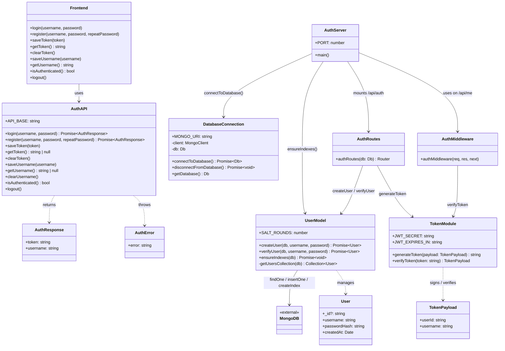

# Authentication Service Class Diagram

This class diagram models the modules, interfaces, and relationships derived from the authentication sequence diagram and source code.

## Class Descriptions

| Class / Module | File | Responsibility |
|----------------|------|----------------|
| `Frontend` | `webapp/src/auth.api.ts` | UI-facing auth helpers for login, registration, and local token storage. |
| `AuthAPI` | `webapp/src/auth.api.ts` | HTTP client that calls the `/api/auth` endpoints and manages `localStorage`. |
| `AuthServer` | `auth/server.ts` | Bootstraps Express, connects to MongoDB, mounts routes, and starts listening. |
| `DatabaseConnection` | `db/connection.ts` | Manages the MongoDB client lifecycle and provides the `Db` instance. |
| `AuthRoutes` | `auth/routes/auth.routes.ts` | Defines `/register` and `/login` endpoints and orchestrates model + token calls. |
| `UserModel` | `auth/lib/user.model.ts` | Handles MongoDB user queries, bcrypt hashing, and password verification. |
| `TokenModule` | `auth/lib/token.ts` | Signs and verifies JWT tokens with `JWT_SECRET` and a 24-hour expiry. |
| `AuthMiddleware` | `auth/middleware/auth.middleware.ts` | Validates the `Authorization` header and attaches the decoded user to `req.user`. |
| `MongoDB` | external | Document store used for persisting user records and unique indexes. |

## Key Relationships

- **Frontend → AuthAPI**: The frontend consumes the auth API helpers to communicate with the server.
- **AuthServer → DatabaseConnection**: The server initializes the MongoDB connection on startup.
- **AuthServer → UserModel**: The server triggers index creation (`ensureIndexes`) before accepting traffic.
- **AuthServer → AuthRoutes**: The server mounts the auth router under `/api/auth`.
- **AuthServer → AuthMiddleware**: The protected `/api/me` route uses the middleware.
- **AuthRoutes → UserModel**: Registration and login routes delegate user persistence and verification.
- **AuthRoutes → TokenModule**: After successful authentication, a JWT is generated and returned.
- **AuthMiddleware → TokenModule**: Incoming tokens are verified before the request proceeds.
- **UserModel → MongoDB**: User documents are stored, queried, and indexed in MongoDB.
