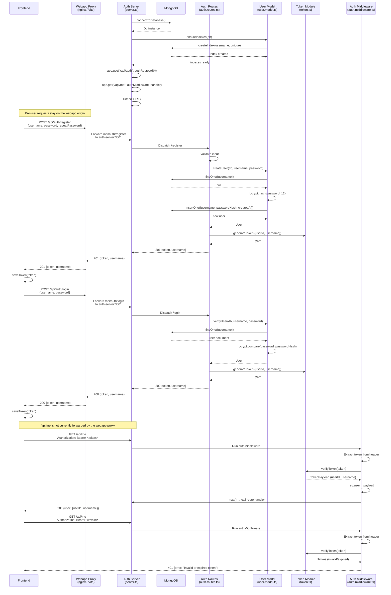

# Authentication Service Sequence Diagram

This diagram shows how the webapp proxy, `server`, `auth.routes`, `auth.middleware`, `token`, and `user.model` modules interact with **MongoDB** and the **Frontend** during registration, login, and protected-route access.

## Flow Summary

1. **Webapp proxy routing**
   - The frontend uses relative `/api/auth/*` URLs, so browser requests stay on the webapp origin and do not require CORS.
   - In the Docker/Codespaces build, `webapp/nginx.conf` forwards `/api/auth/` to `http://auth-server:3001/api/auth/` using Docker service discovery.
   - During `npm run dev`, `webapp/vite.config.ts` forwards `/api/auth` to `http://localhost:3001`.
   - Nginx sends remaining `/api/` requests to the inference service at `http://inference:8000`.

2. **Server startup** (`server.ts`)
   - Connects to MongoDB via `connectToDatabase()`.
   - Calls `ensureIndexes(db)` to create a unique index on `username`.
   - Mounts `/api/auth` routes from `auth.routes.ts`.
   - Registers the protected `/api/me` route with `authMiddleware`.

3. **Registration** (`POST /api/auth/register`)
   - The frontend sends `{username, password, repeatPassword}`.
   - `auth.routes.ts` validates input length and password match.
   - `user.model.ts` checks for existing usernames and inserts a new document with a bcrypt hash (12 rounds).
   - `token.ts` generates a signed JWT (24-hour expiry).
   - The frontend receives `{token, username}` and stores the token.

4. **Login** (`POST /api/auth/login`)
   - The frontend sends `{username, password}`.
   - `user.model.ts` fetches the user and verifies the password with bcrypt.
   - `token.ts` generates a signed JWT.
   - The frontend receives `{token, username}` and stores the token.

5. **Protected route access** (`GET /api/me`)
   - The frontend includes the token in the `Authorization: Bearer <token>` header.
   - `auth.middleware.ts` extracts the token and calls `verifyToken()`.
   - On success, the decoded payload is attached to `req.user` and the request proceeds.
   - On failure, a `401 Unauthorized` response is returned immediately.
   - The auth server exposes this route, but the current webapp nginx and Vite proxies do not forward `/api/me`; browser access through the webapp origin requires an additional proxy rule.

## Module Responsibilities

| Module | Responsibility |
|--------|----------------|
| `webapp/nginx.conf` | Proxies containerized `/api/auth/` requests to `auth-server:3001` and other `/api/` requests to `inference:8000`. |
| `webapp/vite.config.ts` | Proxies local-development `/api/auth` requests to `localhost:3001`. |
| `server.ts` | Bootstraps Express, connects to MongoDB, mounts routes, and starts listening. |
| `auth.routes.ts` | Defines `/register` and `/login` endpoints and orchestrates model + token calls. |
| `auth.middleware.ts` | Validates the `Authorization` header and attaches the decoded user to `req.user`. |
| `token.ts` | Signs and verifies JWT tokens with `JWT_SECRET` and a 24-hour expiry. |
| `user.model.ts` | Handles MongoDB user queries, bcrypt hashing, and password verification. |
| `db/connection.ts` | Manages the MongoDB client lifecycle and provides the `Db` instance. |
