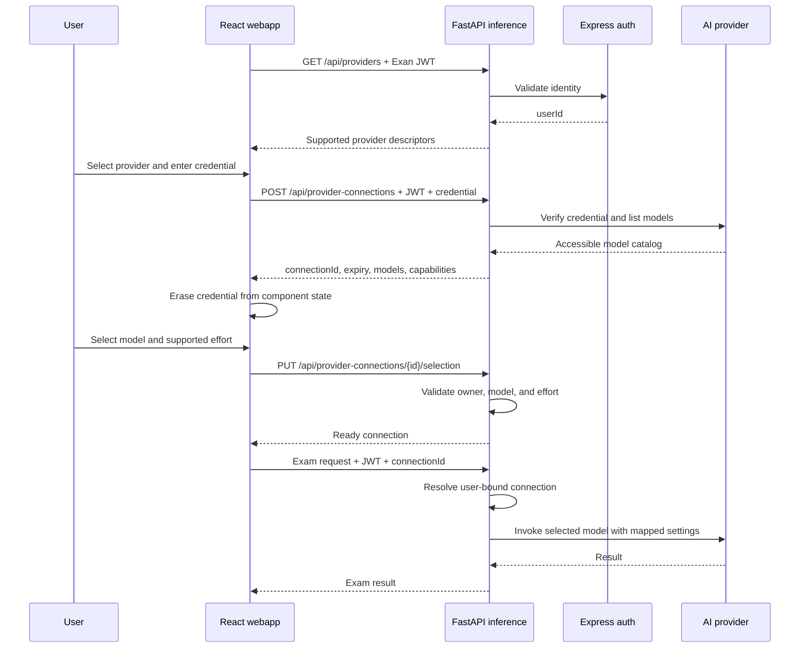

# Runtime Provider, Credential, Model, and Effort Selection (PENDING TO READ)

## Purpose

This document describes how Exan can let an authenticated user:

1. select an AI provider;
2. supply a provider credential at runtime;
3. verify that the credential can access the provider;
4. select an accessible model; and
5. select a reasoning effort when the chosen model supports it.

The recommended design is a short-lived, server-side provider connection. The browser submits the credential once, the inference service verifies it, and subsequent requests use an opaque connection ID rather than resending the credential.

## Terminology: "Mounting" a Token

Docker volume or secret mounting happens when a container starts and is service-wide. It is not a suitable mechanism for concurrent, per-user runtime credentials.

For this feature, "mount the token" should mean **attach a credential to an authenticated, short-lived provider connection**. The credential stays server-side after verification and is never returned to the browser.

## Current Project Findings

### Frontend

- `webapp/src/components/ProviderSelector.tsx` displays only providers whose `available` field is already true. A user therefore cannot select an unconfigured cloud provider and enter a credential.
- `webapp/src/components/ExamComparison.tsx` and `webapp/src/components/GrammarEvaluation.tsx` each own provider state independently.
- `webapp/src/lib/api.ts` sends only a provider name with inference requests. It has no credential, connection, model, or reasoning fields.
- The Exan JWT is stored by `webapp/src/auth.api.ts`, but inference requests do not send it.
- Authentication currently gates the React UI, not the FastAPI endpoints.

### Inference service

- `inference/app/config.py` loads provider credentials and most model defaults from process environment variables.
- Gemini and Claude model IDs are hard-coded in their provider classes. GPT, Ollama, and LM Studio use process-level settings.
- `inference/app/providers/registry.py` considers a cloud provider available when an environment key is non-empty. It does not verify the credential with the provider.
- Local availability checks ping Ollama and LM Studio, but their model catalogs are discarded.
- `BaseProvider` has no credential injection, model discovery, model selection, capability, or reasoning-effort contract.
- All provider instances are created from global settings.
- FastAPI endpoints are unauthenticated. Exam and answer-key data is held in global in-memory dictionaries without user ownership.
- Raw upstream exception text can be returned to clients. This may expose sensitive details.

### Auth and deployment

- The Express service issues a 24-hour JWT containing `userId` and `username`.
- Provider credentials are not represented in the user model.
- Nginx routes `/api/auth/*` to `auth-server` and all other `/api/*` requests to `inference`.
- `docker-compose.yml` loads `inference/.env` into the inference process. Those values are deployment-wide, not per-user.
- Inference, auth, and MongoDB ports are published directly. Nginx is therefore not an enforced security boundary in the current Compose setup.

## Recommended Runtime Flow



The UI should use these states:

```text
loading providers -> select provider -> enter credential -> verifying
-> select model -> select effort (when supported) -> ready
```

Local providers skip credential entry but still require availability and model discovery. Changing provider invalidates the connection, model, effort, and any workflow state that depends on them.

## Credential Handling Methods

| Method | How it works | Pros | Cons | Fit for Exan |
| --- | --- | --- | --- | --- |
| Deployment environment variables | Operator puts shared keys in `inference/.env` | Already implemented; simplest deployment | Shared by all users; no runtime selection; weak rotation; environment exposure | Keep as an optional operator-managed mode, not the requested feature |
| Docker secret file | Container reads a shared key from `/run/secrets` | Better than plain environment variables; works for operator-managed keys | Still service-wide and startup-oriented; not per-user; reload/rotation required | Useful for production deployment defaults only |
| Credential on every inference request | Browser includes the provider token with every upload | Stateless server; minimal storage | Repeated secret transmission; easy to log accidentally; couples secrets to large multipart requests | Acceptable only for a constrained prototype over TLS |
| Browser-to-provider calls | Browser calls the provider directly | Exan backend never stores the token | Browser exposure; provider CORS limitations; duplicated adapters; bypasses server controls; poor local-provider support | Not recommended |
| Short-lived server connection | Browser submits the token once; server stores it behind an opaque ID with a TTL | Good security/complexity balance; supports multi-step workflows; easy expiry and logout cleanup | Requires authenticated ownership, TTL storage, cleanup, and sticky/single-instance constraints if stored in memory | **Recommended first implementation** |
| Encrypted persistent credentials | Store per-user encrypted credentials in a separate database collection | Good repeat-login UX; supports saved configurations | Key management, rotation, deletion, backup, audit, and breach impact are substantial | Optional later feature, not required for runtime-only use |
| External secret vault | Store only a vault reference in Exan; retrieve through workload identity | Strongest audit, access policy, and rotation model | Additional infrastructure, cost, latency, and outage handling | Recommended for high-assurance production deployments |
| Per-user inference container | Start a container with one user's credential | Strong process isolation; reuses environment-based adapters | Expensive startup and orchestration; poor scaling; Compose is not a session scheduler | Not recommended for this project |

## Recommended Architecture

### Initial single-instance implementation

Use a short-lived provider connection owned by the inference service:

```text
connection_id -> {
  user_id,
  provider,
  secret,
  verified_models,
  selected_model,
  selected_effort,
  created_at,
  expires_at
}
```

Requirements:

- Generate at least 128 bits of cryptographically random entropy for the opaque ID.
- Bind every connection lookup to the authenticated `userId`.
- Store the provider secret only in server memory.
- Apply a short idle and absolute TTL, for example 30 minutes idle and 8 hours absolute.
- Delete connections on explicit disconnect and best-effort logout.
- Never serialize, log, or return the secret.
- Document that in-memory connections are lost on restart and support only one inference replica.

This matches the project's current single-process in-memory workflow storage and can be implemented without adding a database. It must not be presented as horizontally scalable.

### Production evolution

Replace the in-process store with one of these:

1. a dedicated TTL store with persistence disabled and transport encryption; or
2. an external secrets vault, storing only a connection-to-vault-reference mapping.

If users need saved credentials across sessions, put credential metadata in a separate collection rather than the `User` document. Encrypt secrets with authenticated envelope encryption and a versioned key that is separate from `JWT_SECRET`.

FastAPI should own short-lived provider connections because it consumes the credentials. If persistent credentials are added, the auth service should act as the credential broker and FastAPI should resolve credentials through an authenticated internal API. FastAPI should not gain direct MongoDB access solely for this feature.

## Authentication Prerequisite

Provider credentials cannot be isolated safely until every inference endpoint authenticates the Exan user.

Two practical methods are available:

| Method | Pros | Cons | Recommendation |
| --- | --- | --- | --- |
| FastAPI calls auth introspection | Auth remains owned by Express; no JWT signing secret shared with inference | Adds an internal request and auth-service dependency | Best fit for the initial architecture; cache successful introspection briefly |
| FastAPI verifies JWT locally | No network hop; works if auth is temporarily unavailable | Shares HMAC secret and duplicates validation rules; rotation is harder | Use only if issuer, audience, algorithm, and key rotation are defined; asymmetric signing is preferable |

For the first method, expose or standardize an internal auth identity endpoint and configure `AUTH_SERVER_URL=http://auth-server:3001` for inference. In development, the Vite proxy must preserve the same public API behavior.

Also bind `_exams` and `_answer_keys` to `userId`; otherwise adding authenticated provider connections would still leave exam data accessible across users.

## Proposed API Contract

### List supported providers

`GET /api/providers`

Return all supported providers. Do not hide cloud providers merely because no deployment-wide key is configured.

```json
[
  {
    "id": "gpt",
    "label": "OpenAI",
    "kind": "cloud",
    "credential_modes": ["user", "deployment"],
    "credential_required": true
  },
  {
    "id": "ollama",
    "label": "Ollama",
    "kind": "local",
    "credential_modes": ["none"],
    "credential_required": false
  }
]
```

This endpoint describes support, not verified user access.

### Create and verify a connection

`POST /api/provider-connections`

```json
{
  "provider": "gpt",
  "credential": "user-supplied-secret",
  "credential_mode": "user"
}
```

Return only non-secret state:

```json
{
  "id": "opaque-connection-id",
  "provider": "gpt",
  "status": "verified",
  "expires_at": "2026-08-01T12:00:00Z",
  "models": [
    {
      "id": "provider-model-id",
      "label": "Provider model label",
      "input_capabilities": ["text", "image"],
      "reasoning_options": [
        { "id": "low", "label": "Low" },
        { "id": "medium", "label": "Medium" },
        { "id": "high", "label": "High" }
      ],
      "default_reasoning_option": "medium"
    }
  ]
}
```

Use `SecretStr` or equivalent request redaction, while recognizing that redaction is not encryption.

### Select model and effort

`PUT /api/provider-connections/{connection_id}/selection`

```json
{
  "model_id": "provider-model-id",
  "reasoning_option_id": "medium"
}
```

The server must verify:

- the connection belongs to the authenticated user;
- the connection has not expired;
- the model was discovered for this connection;
- the model supports Exan's required input mode;
- the effort option belongs to that model.

Return `reasoning_options: []` for models without a supported effort control. The frontend should then omit or disable the effort selector.

### Execute inference

Replace the free-form `provider` field on all exam and batch endpoints with `provider_connection_id`. The server resolves provider, credential, model, and effort from the connection. Do not accept a client-supplied provider or model that bypasses the verified connection.

Freeze the selected connection configuration for an active exam workflow. This prevents template extraction, answer-key extraction, and answer comparison from silently using different models.

### Disconnect

`DELETE /api/provider-connections/{connection_id}`

Delete the connection immediately. Return `204` even if the connection is already absent, provided the caller is authenticated.

### Error behavior

Use stable error codes and sanitized messages:

| HTTP status | Example code | Meaning |
| --- | --- | --- |
| `400` | `UNKNOWN_PROVIDER` | Provider ID is not supported |
| `401` | `INVALID_APP_SESSION` | Exan authentication failed |
| `401` | `PROVIDER_AUTH_FAILED` | Provider rejected the credential |
| `403` | `MODEL_ACCESS_DENIED` | Credential cannot use the selected model |
| `404` | `CONNECTION_NOT_FOUND` | Missing connection or not owned by this user |
| `410` | `CONNECTION_EXPIRED` | Connection TTL elapsed |
| `422` | `UNSUPPORTED_CONFIGURATION` | Model/effort/capability combination is invalid |
| `429` | `PROVIDER_RATE_LIMITED` | Upstream rate limit |
| `502` | `PROVIDER_ERROR` | Sanitized upstream failure |
| `503` | `PROVIDER_UNAVAILABLE` | Provider or local service is unavailable |

Never return raw provider exceptions or credentials.

## Provider Model and Effort Discovery

Provider catalogs and reasoning controls are not uniform. The backend must expose a normalized capability response while retaining provider-specific mappings internally.

| Provider | Current Exan behavior | Runtime model discovery | Effort handling |
| --- | --- | --- | --- |
| Gemini | Hard-coded `gemini-2.5-flash` | Use the Google model catalog and filter to generation models usable by Exan | Thinking controls are model-dependent; advertise only options supported by the selected model |
| Claude | Hard-coded `claude-sonnet-4-20250514` | Use the Anthropic model catalog, then apply an Exan allowlist/capability table | Thinking and effort support varies by model and API version; translate backend option IDs to provider parameters |
| GPT | Process-level `OPENAI_MODEL` | Use the OpenAI model catalog, then apply an Exan allowlist/capability table | Reasoning effort is supported only by relevant reasoning models; ordinary chat/vision models should return no options |
| Ollama | Process-level `OLLAMA_MODEL` | Read `/api/tags` | Treat effort as unsupported until the installed model and Ollama API are explicitly capability-tested |
| LM Studio | Process-level `LMSTUDIO_MODEL` | Read `/v1/models` | Do not assume OpenAI reasoning support merely because the API is OpenAI-compatible |

A successful model-list call verifies that a credential reaches the account, but it does not prove vision support, structured-output behavior, quota, or permission to invoke every model. Use both:

1. model discovery plus an Exan-maintained capability allowlist; and
2. an optional tiny preflight invocation after model selection when stronger verification is needed.

The UI should disclose that a preflight can incur cost. Cache model catalogs briefly per connection to limit provider calls, but revalidate the selected model at execution time.

Do not model effort as one mandatory global enum. Return provider/model-specific option IDs and labels. A model with no reasoning control remains valid and simply has an empty options list.

## Required Changes by Area

### React webapp

Likely files:

- `webapp/src/App.tsx`
- `webapp/src/components/ProviderSelector.tsx`
- a new provider setup component or hook
- `webapp/src/components/ExamComparison.tsx`
- `webapp/src/components/GrammarEvaluation.tsx`
- `webapp/src/lib/api.ts`
- `webapp/src/auth.api.ts`
- `webapp/src/lib/i18n.tsx`
- component tests under `webapp/src/test/`

Changes:

- Move provider connection state to `App` or a shared provider-connection context so both workflows use one verified configuration.
- Display all supported providers and distinguish unconfigured, verifying, verified, unavailable, and expired states.
- Keep the provider credential only in controlled component state until verification, then erase it.
- Use a password input with no browser persistence and no analytics capture.
- Send the Exan bearer token with every inference request.
- Add model selection after verification and capability-driven effort selection after model selection.
- Clear dependent state when provider/model changes, connection expires, or the user logs out.
- Never place provider credentials in `localStorage`, `sessionStorage`, URLs, error text, or workflow multipart forms.

### FastAPI inference

Likely files:

- `inference/app/main.py`
- `inference/app/config.py`
- `inference/app/models/__init__.py`
- `inference/app/providers/__init__.py`
- `inference/app/providers/registry.py`
- all concrete provider adapters
- new authentication and provider-connection modules
- `inference/pyproject.toml`
- tests under `inference/tests/`

Changes:

- Authenticate every endpoint and resolve `userId`.
- Add provider descriptors, connection request/response, model capability, and selection models.
- Refactor provider constructors to accept explicit credential, model, and provider-specific reasoning configuration.
- Add `verify_access`, `list_models`, and `validate_selection` behavior to the provider abstraction.
- Implement an owner-bound TTL connection store.
- Resolve inference requests by connection ID.
- Bind exams and answer keys to the authenticated owner and frozen provider configuration.
- Sanitize upstream errors and avoid logging request secrets.
- Run synchronous cloud SDK calls in a thread pool or adopt async clients so verification and inference do not block the event loop.

### Express auth and MongoDB

Initial ephemeral implementation:

- Standardize an identity/introspection endpoint for internal FastAPI use.
- Strengthen JWT validation with explicit issuer, audience, algorithm, and non-default production secrets.

Only if saved credentials are added later:

- Add a separate provider-credential model/collection.
- Return metadata only; never return stored secret values.
- Add encryption or vault-reference modules, key rotation, deletion, and audit behavior.
- Keep provider credentials out of the existing user document.

### Nginx, Vite, and Compose

Likely files:

- `docker-compose.yml`
- `webapp/nginx.conf`
- `webapp/vite.config.ts`
- environment example files

Changes:

- Configure the inference-to-auth internal URL, or JWT verification keys if local verification is selected.
- Keep service names `inference` and `auth-server` unchanged.
- Preserve `Authorization` headers through Nginx and the Vite development proxy.
- Add TLS at the deployment edge before accepting user-supplied credentials outside local development.
- In production, stop publishing inference, auth, and MongoDB directly unless protected by a firewall; expose the application through the edge proxy.
- Add request-body redaction and suitable proxy timeouts without logging credentials.
- Docker secrets may replace deployment-wide `.env` keys, but they are independent of per-user provider connections.

## Implementation Sequence

1. Authenticate all inference requests and add user ownership to exam state.
2. Refactor provider construction to accept explicit runtime configuration.
3. Add provider descriptors and short-lived connection create/delete endpoints.
4. Implement credential verification and provider model discovery.
5. Add model capability and reasoning-option validation.
6. Replace workflow `provider` fields with `provider_connection_id`.
7. Add the frontend provider setup state machine and JWT headers.
8. Add disconnect, expiry, logout cleanup, and sanitized errors.
9. Harden Nginx/Compose exposure and add TLS for deployed use.
10. Add persistent encrypted storage or a vault only if required.

Steps 1 and 2 are prerequisites. Accepting provider secrets before inference authentication and user ownership are in place would create a cross-user credential risk.

## Verification Plan

### Inference tests

- provider descriptor contract;
- valid and invalid cloud credentials using mocked SDKs;
- local provider availability and model discovery;
- no credential values in logs or responses;
- connection ownership, expiry, deletion, and cross-user denial;
- model access and capability filtering;
- models with and without reasoning options;
- provider-specific effort translation;
- every Exam Comparison and Grammar Evaluation endpoint resolving the same frozen connection;
- sanitized upstream authentication, rate-limit, and provider errors.

### Frontend tests

- provider selection exposes credential entry when required;
- credential is erased after success and failure cleanup;
- model controls appear only after successful verification;
- effort controls follow selected-model capabilities;
- changing provider/model clears invalid dependent state;
- expired connections return the UI to credential entry;
- logout disconnects and clears connection state;
- all inference requests include Exan authentication but never the provider credential.

### Auth and end-to-end tests

- unauthenticated inference requests return `401`;
- JWT identity cannot access another user's connection or exam;
- auth introspection failure fails closed;
- Nginx and Vite preserve auth headers and route each endpoint correctly;
- direct backend ports are unavailable in the production profile;
- Compose configuration remains valid.

Suggested validation commands:

```bash
cd inference
uv run ruff check app tests
uv run pytest -v

cd ../webapp
bun run test
bun run lint
bun run build

cd ..
npx tsc --noEmit
docker compose config --quiet
docker compose build inference auth-server webapp
```

## Acceptance Criteria

The feature is complete when:

- an authenticated user can select every supported provider;
- cloud credentials are submitted once and are not persisted in the browser;
- invalid credentials fail before model selection;
- successful verification returns only models accessible and allowed for Exan;
- reasoning effort appears only for models that support a mapped option;
- all inference calls use an unexpired connection owned by the caller;
- one user cannot access another user's connections, exams, or answer keys;
- provider credentials never appear in URLs, logs, responses, JWTs, MongoDB plaintext, or workflow forms;
- local Ollama and LM Studio workflows continue to work without cloud credentials;
- deployment-wide credentials remain available only as an explicit optional mode;
- the same verified provider/model/effort configuration is used for the full exam workflow.

## Decision Summary

Implement **authenticated, short-lived provider connections** first. Store user-supplied credentials only in inference-service memory, return an opaque connection ID, discover models server-side, and make reasoning options capability-driven per model. Preserve environment or Docker-secret credentials as an optional administrator-managed mode.

Do not use runtime environment mutation, per-user Docker secret mounts, browser persistence, or direct browser-to-provider calls. Introduce encrypted persistent credentials or an external vault only when cross-session reuse, multiple inference replicas, or production assurance requirements justify the added operational burden.
