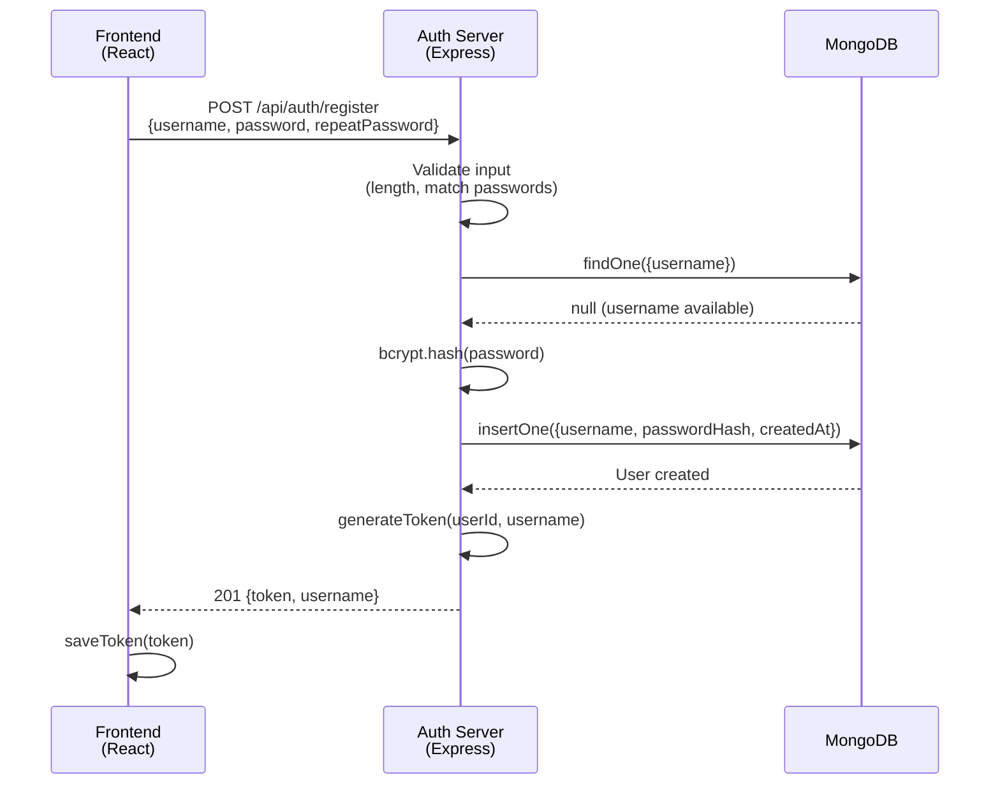

# User Creation Sequence Diagram

This diagram shows how the four services interact when creating a new user.

## Flow Summary

1. **Frontend** sends registration request with credentials
2. **Auth Server** validates input (length, passwords match)
3. **Auth Server** checks if username exists in **MongoDB**
4. **Auth Server** hashes password with bcrypt (12 rounds)
5. **Auth Server** stores user document in **MongoDB**
6. **Auth Server** generates JWT token
7. **Auth Server** returns token to **Frontend**
8. **Frontend** stores token in localStorage

> **Note:** The Backend (FastAPI) service is not involved in user creation—it handles exam processing and AI provider interactions.
