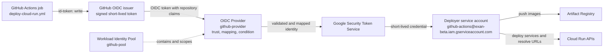
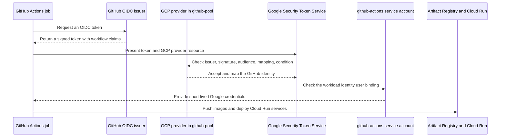
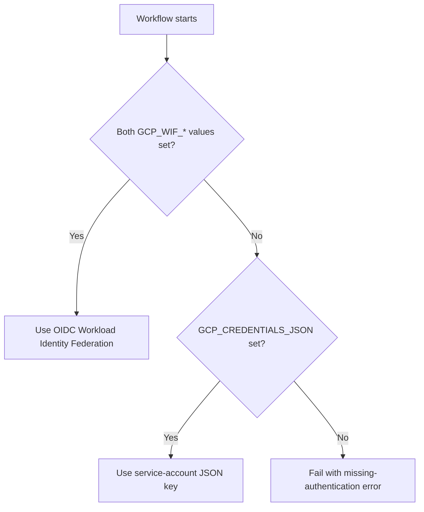
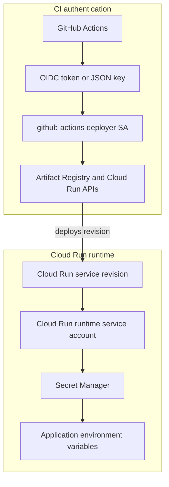

# GitHub Actions OIDC and Workload Identity Federation

This guide explains how the `deploy-cloud-run.yml` workflow authenticates to Google Cloud and how that authentication relates to the Workload Identity Pool and the application secrets in Secret Manager.

Related setup guides:

- [Step 1: GCP Project & Foundation Setup](STEP_1_GCP_PROJECT_SETUP.md)
- [Step 3: Secrets & API Keys Setup](STEP_3_SECRETS_SETUP.md)
- [Deployment workflow](../../.github/workflows/deploy-cloud-run.yml)

## The problem this solves

The GitHub Actions job must authenticate to Google Cloud before it can:

- push images to Artifact Registry;
- deploy `auth-server`, `inference`, and `webapp` to Cloud Run; and
- query Cloud Run for the deployed service URLs.

The recommended solution is Workload Identity Federation (WIF). WIF lets GitHub present a short-lived OIDC token to Google Cloud. Google validates that token and grants the workflow short-lived access as the `github-actions` service account.

No long-lived Google private key needs to be stored in GitHub when WIF is used.

## What OIDC means

OpenID Connect (OIDC) is a standard for proving the identity of a workload using a signed token. In this project:

- **GitHub is the identity provider.** It issues a token for a particular Actions job.
- **The token contains claims.** Claims describe the repository and other workflow context, such as the subject and ref.
- **Google is the relying party.** Google checks the token issuer, signature, audience, and configured claims before accepting it.
- **The token is short-lived.** It is intended for this job and expires instead of becoming a permanent credential.

The workflow grants the job permission to request this token with:

```yaml
permissions:
  id-token: write
```

This permission does not give the job Google Cloud access by itself. It only allows the job to ask GitHub for an identity token that Google can evaluate.

## The Google Cloud pieces

| Piece | Role in this project |
| --- | --- |
| Workload Identity Pool: `github-pool` | A logical boundary for identities coming from outside Google Cloud. |
| OIDC Provider: `github-provider` | Describes how Google should trust and interpret GitHub's OIDC tokens. |
| Attribute mapping | Copies a GitHub claim such as `assertion.repository` to a Google attribute such as `attribute.repository`. |
| Attribute condition | Restricts which GitHub tokens the provider accepts, for example `OWNER/REPO`. |
| Deployer service account: `github-actions@exan-beta.iam.gserviceaccount.com` | The Google identity that receives the deployment permissions. |
| `roles/iam.workloadIdentityUser` binding | Allows the approved external GitHub identity to impersonate the deployer service account. |
| Google Security Token Service | Exchanges the accepted external identity for short-lived Google credentials. |
| Artifact Registry and Cloud Run IAM roles | Define what the deployer service account can do after authentication. |

The pool does not store passwords, API keys, or Secret Manager values. It also does not grant permissions on its own. It groups external identities and provides the boundary in which providers and IAM bindings are evaluated.

## How the authentication flow works



At a high level, the sequence is:



The workflow does not search Google Cloud for a secret named `GCP_WIF_PROVIDER`. It reads the GitHub repository configuration values supplied by the repository owner, then gives those values to `google-github-actions/auth@v2`.

## Where the pool fits

A pool is best understood as a trust boundary or identity namespace:

1. The pool contains the external identity providers that Google is willing to evaluate.
2. `github-provider` says that tokens from `https://token.actions.githubusercontent.com` are eligible for evaluation.
3. The provider maps GitHub claims into Google attributes and applies the repository condition.
4. The IAM binding uses the pool and mapped repository attribute to identify who may impersonate `github-actions`.
5. The service account's project roles determine what that authenticated workflow may do.

For this project, the important restriction is that the binding should identify the actual repository:

```text
principalSet://iam.googleapis.com/projects/PROJECT_NUMBER/locations/global/workloadIdentityPools/github-pool/attribute.repository/OWNER/REPO
```

The provider condition and the IAM member restriction are complementary checks. Both should refer to the intended repository. A token from another repository should not be able to impersonate the Exan deployer service account.

A pool can contain more than one provider, which is useful when an organization trusts multiple external CI systems. This project only needs one provider for GitHub Actions, but keeping the pool and provider as separate concepts makes the trust relationship explicit and extensible.

## GitHub repository values

The current workflow reads these values from **Settings -> Secrets and variables -> Actions**:

```text
GCP_WIF_PROVIDER=projects/PROJECT_NUMBER/locations/global/workloadIdentityPools/github-pool/providers/github-provider
GCP_WIF_SERVICE_ACCOUNT=github-actions@exan-beta.iam.gserviceaccount.com
GCP_RUN_SERVICE_ACCOUNT=exan-cloudrun-runtime@exan-beta.iam.gserviceaccount.com
```

Replace `PROJECT_NUMBER` with the numeric GCP project number. Use the repository owner and name, not the project ID, in the provider condition and IAM binding:

```text
OWNER/REPO
```

`GCP_WIF_PROVIDER` and `GCP_WIF_SERVICE_ACCOUNT` are identifiers that tell the authentication action which provider and service account to use. `GCP_RUN_SERVICE_ACCOUNT` is the runtime identity passed to every `gcloud run deploy` via `--service-account`. They are stored as GitHub repository secrets because the workflow reads them through the `secrets` context; they are not application secrets retrieved from GCP.

### Fallback when WIF is not configured

The workflow supports a service-account key as a fallback. In that mode:

- `GCP_CREDENTIALS_JSON` contains the complete contents of a JSON key for the `github-actions` service account;
- `GCP_WIF_PROVIDER` and `GCP_WIF_SERVICE_ACCOUNT` are absent or incomplete; and
- `google-github-actions/auth@v2` authenticates with `credentials_json` instead of WIF.

The values therefore mean:

| GitHub value | What it contains |
| --- | --- |
| `GCP_WIF_PROVIDER` | `projects/PROJECT_NUMBER/locations/global/workloadIdentityPools/github-pool/providers/github-provider` |
| `GCP_WIF_SERVICE_ACCOUNT` | `github-actions@exan-beta.iam.gserviceaccount.com` |
| `GCP_CREDENTIALS_JSON` | The entire JSON service-account key document, including its private key. |
| `GCP_RUN_SERVICE_ACCOUNT` | `exan-cloudrun-runtime@exan-beta.iam.gserviceaccount.com` |

The workflow behavior is:



WIF is preferred because the GitHub repository never stores a reusable Google private key. If a JSON key is used, protect it as a high-risk credential, limit the service account's roles, rotate it, and revoke it when it is no longer needed.

## CI authentication and application secrets are separate

There are two independent credential paths in this deployment:



### CI authentication

The `github-actions` service account is used by the workflow to push images and call deployment APIs. Its permissions come from roles such as:

- `roles/run.admin`;
- `roles/artifactregistry.writer`; and
- `roles/iam.serviceAccountUser`.

### Runtime secret access

The `--set-secrets` flags in the workflow refer to existing Secret Manager entries:

```text
JWT_SECRET
MONGO_URI
GEMINI_API_KEY
```

Cloud Run reads those values when the service runs. It uses the Cloud Run service's runtime identity, not the GitHub OIDC token and not the `github-actions` repository secret. The runtime identity must have Secret Manager access, as described in [Step 3](STEP_3_SECRETS_SETUP.md).

The WIF pool therefore does not help the application read `JWT_SECRET` or `GEMINI_API_KEY`. It only helps the deployment job authenticate to Google Cloud.

### Important project wiring note

Every `gcloud run deploy` command in the workflow passes `--service-account "${{ secrets.GCP_RUN_SERVICE_ACCOUNT }}"`, which must be the dedicated runtime account `exan-cloudrun-runtime@exan-beta.iam.gserviceaccount.com` — the same account Terraform assigns to its Cloud Run services. That account must have `roles/secretmanager.secretAccessor` on the application secrets, and the `github-actions` deployer must have `roles/iam.serviceAccountUser` on it (otherwise the deploy fails with an `iam.serviceAccounts.actAs` error).

The default compute account (`PROJECT_NUMBER-compute@developer.gserviceaccount.com`) is not used by any deployment path and does not need Secret Manager access. This is separate from the WIF setup: the `github-actions` account deploys the revision, while the Cloud Run runtime identity reads secrets when the revision starts.

## Short mental model

```text
GitHub proves the workflow identity
    -> WIF maps it to an approved Google identity
    -> IAM grants that identity deployment permissions
    -> Cloud Run runs the deployed revision
    -> the runtime identity reads application secrets from Secret Manager
```

WIF answers: **"Who is allowed to deploy?"**

Secret Manager and the Cloud Run runtime service account answer: **"Which credentials may the running application read?"**

## Official references

- [Workload Identity Federation with deployment pipelines](https://cloud.google.com/iam/docs/workload-identity-federation-with-deployment-pipelines)
- [Workload Identity Federation for GitHub Actions](https://github.com/google-github-actions/auth#workload-identity-federation-through-a-service-account)
- [Configuring Cloud Run secrets](https://cloud.google.com/run/docs/configuring/secrets)
