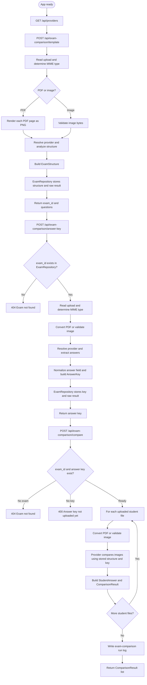
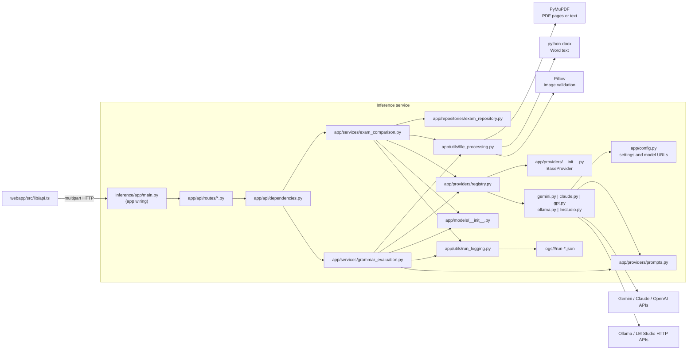

# Inference App Lifecycle

This guide explains how the FastAPI inference app is started, how each route is
used, and how the MVP structure evolved into a standard FastAPI layout.

## MVP Snapshot: Before Refactor

The original MVP concentrated all five HTTP routes and their workflow logic in
`inference/app/main.py`. The module handled:

- multipart upload and form-field parsing
- file conversion and text extraction
- provider resolution and AI calls
- Pydantic response construction
- in-memory exam and answer-key dictionaries
- run-log creation and HTTP error conversion

This was functional for the MVP, but route registration, HTTP concerns, and
workflow orchestration were coupled in one module.

## Refactored Snapshot: Current Structure

`main.py` now creates the FastAPI application, installs CORS, and registers
routers. The application is split into these ownership boundaries:

| Boundary | Responsibility |
| --- | --- |
| `app/api/routes/providers.py` | Provider discovery HTTP endpoint. |
| `app/api/routes/exam_comparison.py` | Exam Comparison upload HTTP concerns and error-to-HTTP translation. |
| `app/api/routes/grammar_evaluation.py` | Grammar Evaluation form parsing and HTTP errors. |
| `app/api/dependencies.py` | Constructs injectable repositories and workflow services. |
| `app/services/exam_comparison.py` | Template, answer-key, and answer-comparison orchestration. |
| `app/services/grammar_evaluation.py` | Text extraction, grammar evaluation, and logging. |
| `app/repositories/exam_repository.py` | In-memory exam and answer-key storage. |
| `app/utils/` | File processing and run logging primitives. |
| `app/providers/` | Provider contract, registry, adapters, and prompts. |

Storage remains process-local and in-memory for this MVP. A restart, container
replacement, or multiple backend instances will not share exam state. Database
storage and migration are future work; this refactor intentionally adds no
database or new persistence service.

## Process Lifecycle

### 1. Import and startup

Uvicorn imports `app.main:app`. Importing `main.py` then:

- Loads settings from `inference/.env` or environment variables through
  `config.py`.
- Imports the provider registry and all configured provider classes.
- Creates the FastAPI application and installs the CORS middleware.
- Imports the route modules and registers their routers.
- Leaves the process-local repository to the dependency provider.

There are no explicit FastAPI startup or shutdown handlers. Providers are
constructed when a request resolves one, rather than during app startup.

### 2. Ready state

The web app calls `GET /api/providers` to populate its provider selector. The
registry reports cloud-provider configuration and probes the local Ollama and
LM Studio endpoints. This check is informational; the selected provider is
resolved again when an evaluation request arrives.

### 3. Request completion

Each route reads the complete upload into memory. Depending on the route:

- Exam comparison routes convert PDFs to page images or validate image files.
- Grammar Evaluation extracts text from PDFs or Word documents.
- The selected provider receives images or text and returns a parsed
  dictionary.
- FastAPI serializes the response model and sends it to the frontend.

Errors are converted to HTTP responses close to the operation that failed:

| Situation | Response |
| --- | --- |
| Unsupported or invalid upload | `400` |
| Unknown `exam_id` | `404` |
| Comparison requested before an answer key | `400` |
| Provider or AI operation failure | `500` |

## Exam Comparison Lifecycle

The exam comparison workflow has an intentional dependency order:



### What persists between steps

The response from template upload contains a generated `exam_id`. The backend
uses that identifier as the key into the in-memory `ExamRepository`:

```text
repository.save_exam(exam_id, structure, raw_result)
```

The repository stores the equivalent record:

```text
{
    "structure": ExamStructure.model_dump(),
    "raw_result": provider_structure_result,
}
```

Answer-key upload must receive that same `exam_id`. It stores the normalized
`AnswerKey` and the original provider response by calling the repository.
Comparison then passes both raw provider results back to `compare_exam` so the
provider can compare the student document against the same exam context.

The repository instance owns dictionaries internally, so it remains suitable
for the MVP workflow but is not durable application storage.

## Grammar Evaluation Lifecycle

`POST /api/grammar-evaluation/evaluate` is independent of the Exam Comparison
stores. The legacy `/api/batch/evaluate` path is an identical compatibility
alias. The canonical route accepts one or more PDF or Word files, then evaluates every file for grammar
in the selected feedback language:

1. Resolve one provider for the request.
2. Extract text from each file.
3. Evaluate grammar using `grammar_evaluation_prompt`, returning structured
  issues and a summary.
4. Build `GrammarEvaluationResponse` with structured grammar feedback and a
  summary derived from the grammar response.
5. Write one `grammar-evaluation` run log and return the response.

The route performs exactly one provider call per file. Legacy multipart fields
from older clients are ignored and do not alter the grammar-only workflow.

## Dependency Diagram

The component graph shows the application wiring separately from request
orchestration and external runtime work.



### Dependency responsibilities

| File or boundary | Responsibility in the lifecycle |
| --- | --- |
| `webapp/src/lib/api.ts` | Builds multipart requests and consumes typed JSON responses. |
| `inference/app/main.py` | Creates the app, installs CORS, and registers routers. |
| `inference/app/api/routes/*.py` | Owns HTTP inputs, response models, and service-error translation. |
| `inference/app/api/dependencies.py` | Constructs the shared in-memory repository and workflow services. |
| `inference/app/services/*.py` | Owns workflow ordering, provider calls, and run-log inputs. |
| `inference/app/repositories/exam_repository.py` | Owns in-memory exam and answer-key records. |
| `inference/app/utils/file_processing.py` | Detects supported types, renders PDFs, validates images, and extracts text. |
| `inference/app/models/__init__.py` | Defines response and nested result contracts through Pydantic. |
| `inference/app/providers/registry.py` | Maps a provider name to its implementation and reports availability. |
| `inference/app/providers/__init__.py` | Defines the shared async provider methods. |
| `inference/app/providers/*.py` | Calls a cloud or local model and parses its JSON response. |
| `inference/app/providers/prompts.py` | Supplies the structure, comparison, and grammar instructions. |
| `inference/app/config.py` | Loads API keys, model names, and local provider URLs. |
| `inference/app/utils/run_logging.py` | Records inputs, outputs, provider metadata, token usage, and elapsed time. |
| `logs/` | Receives completed Exam Comparison and Grammar Evaluation JSON records. |

## Route Reference

| Route | Input | Main dependency path | Output |
| --- | --- | --- | --- |
| `GET /api/providers` | None | `routes/providers.py -> registry.py` | Provider availability list |
| `POST /api/exam-comparison/template` | One PDF or image, provider | `routes/exam_comparison.py -> ExamComparisonService -> file_processing.py -> provider` | `ExamStructure` |
| `POST /api/exam-comparison/answer-key` | One PDF or image, `exam_id`, provider | `routes/exam_comparison.py -> ExamRepository -> ExamComparisonService -> provider` | `AnswerKey` |
| `POST /api/exam-comparison/compare` | One or more PDFs/images, `exam_id`, provider | `routes/exam_comparison.py -> ExamRepository -> ExamComparisonService -> provider` | `ComparisonResult[]` |
| `POST /api/grammar-evaluation/evaluate` | PDFs/Word files, provider, feedback languages | `routes/grammar_evaluation.py -> GrammarEvaluationService -> prompts -> provider` | `GrammarEvaluationResponse` |

The legacy `/api/exam/*` routes are identical Exam Comparison aliases.

## Operational Notes

- The default provider form value is `gemini`, but availability is controlled
  by configuration and local endpoint probes.
- PDFs used by Exam Comparison become one image per page; PDFs used by Grammar
  evaluation remain text extraction inputs.
- A provider instance is selected once per route request. Grammar files reuse
  that instance for all calls in the request.
- A run log is written only after all files and evaluations in the route have
  completed successfully. An exception raised earlier returns an HTTP error
  before the final log write.
- `write_run_log` catches filesystem and serialization failures and logs them
  through Python logging, so log persistence does not replace an evaluation
  response with another exception.
- Because uploaded bytes, rendered pages, provider responses, and result lists
  are held during a request, memory use grows with file size and batch size.