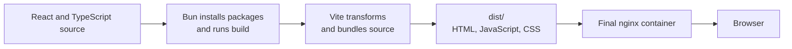
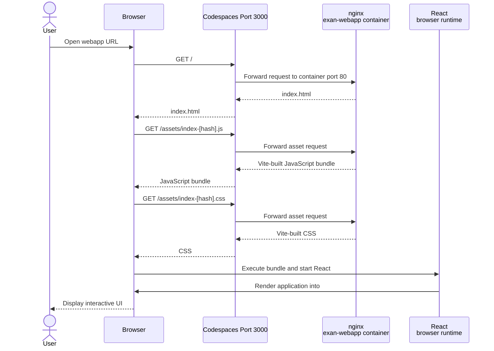
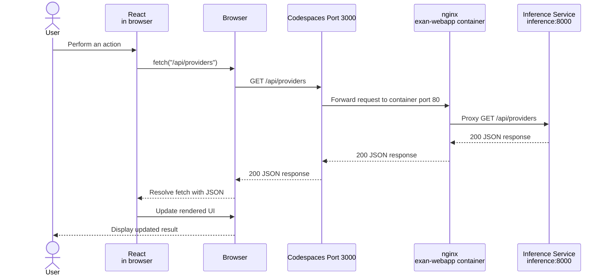
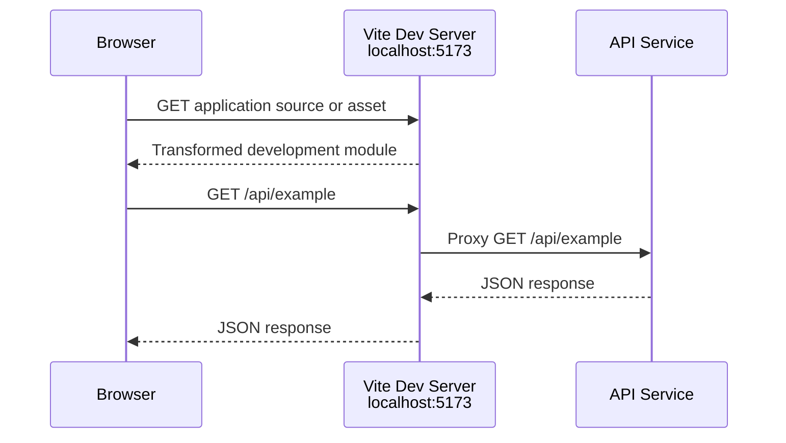

# How Bun, Vite, React, and nginx Work Together

Bun, Vite, React, and nginx participate in the webapp at different times and solve different problems. They are not four servers through which every browser request passes.

The most important distinction is:

- **Build time:** Bun and Vite prepare the application.
- **Browser runtime:** React runs in the user's browser.
- **Production server runtime:** nginx serves files and forwards API requests.

## A Publishing Analogy

Imagine producing and distributing a book:

- **React is the manuscript and its interactive instructions.** It describes what readers see and how the page changes when they interact with it.
- **Vite is the editor and printing press.** It reads the React and TypeScript source, transforms it into browser-compatible JavaScript and CSS, and produces the finished files in `dist/`.
- **Bun is the workshop manager.** It installs the required tools and starts commands such as `vite` or `vite build`. Bun does not design the UI and does not normally receive production browser requests.
- **nginx is the bookstore receptionist.** It gives visitors the finished book files. When a visitor asks for something handled elsewhere, such as authentication, nginx forwards the request to the appropriate service.

The printing press does not remain between the reader and the book after printing. Likewise, Bun and Vite are not part of each production request after the webapp image has been built.

## Responsibilities

| Technology | Purpose in this project | Runs where? | Active in production requests? |
|---|---|---|---|
| Bun | Installs packages and runs package scripts | Docker build stage or developer machine | No |
| Vite | Development server and production asset builder | Docker build stage or developer machine | No, except during local development |
| React | Defines and updates the user interface | Browser after JavaScript loads | Yes, in the browser |
| nginx | Serves built files and proxies API paths | `exan-webapp` container | Yes |

## Production Build

The webapp uses a multi-stage Docker build in `webapp/Dockerfile`.

1. Docker creates a temporary build stage from `oven/bun:1`.
2. Bun installs dependencies from `package.json` and `bun.lock`.
3. Bun runs the `build` script.
4. The script runs TypeScript checks and `vite build`.
5. Vite writes browser-ready HTML, JavaScript, and CSS into `dist/`.
6. Docker creates the final container from `nginx:alpine`.
7. Docker copies only the contents of `dist/` and the nginx configuration into that container.
8. The temporary Bun build stage is not used to serve the application.



This explains why the running `exan-webapp` container is an nginx container even though its Dockerfile begins with Bun.

## What Happens in the Browser

React source files are not executed directly by nginx. nginx returns the files generated by Vite. The browser loads the generated JavaScript, which contains React and the application code. React then renders the application into the `root` element in `index.html`.

After startup, React can respond to clicks, update state, change visible content, and initiate API requests. nginx is not involved in UI rendering; it only serves files and routes network requests.

## Sequence: Loading the Webapp

This is a simple `GET /` request in the Docker/Codespaces environment:



Bun and Vite do not appear in this sequence because their production work already finished during the image build.

## Sequence: A React API GET Request

Suppose React requests an inference endpoint such as `GET /api/providers`:



The browser sees only the webapp origin on port 3000. nginx recognizes `/api/` and forwards it internally to `inference:8000`. This same-origin design avoids requiring the browser to contact the inference container directly.

Authentication uses a more specific nginx rule:

```text
/api/auth/*  -> auth-server:3001
/api/*       -> inference:8000
/            -> static React application files
```

nginx evaluates the more specific `/api/auth/` location for authentication requests before the general `/api/` location.

## Development Mode

When running `bun run dev`, the roles change slightly:

1. Bun starts the `vite` command from `package.json`.
2. Vite runs a development server, commonly on port 5173.
3. Vite transforms source files on demand and supports hot module replacement.
4. Vite proxies `/api/auth` to `localhost:3001` and other `/api` requests to `localhost:8000`.
5. nginx is not required for this development flow.



Vite is therefore both a development server and a production build tool, but it is not the production server in this project.

## Two Meanings of Proxy in This Setup

The word **proxy** can refer to different layers:

1. **Codespaces port forwarding** exposes a port from the Codespace through an HTTPS URL.
2. **Docker port publishing** maps host port 3000 to port 80 inside `exan-webapp`.
3. **nginx reverse proxying** examines paths and forwards API requests to another container.
4. **Vite development proxying** performs similar path forwarding only while the Vite development server is running.

These layers cooperate, but they are not the same proxy. The nginx reverse proxy is a process inside the `exan-webapp` container, not a separate Compose service.

## Quick Mental Model

```text
BUILD:
React source -> Bun runs Vite -> static files -> nginx image

PRODUCTION:
Browser -> Codespaces/Docker forwarding -> nginx
                                          |-> React files
                                          |-> auth-server
                                          `-> inference

DEVELOPMENT:
Browser -> Vite dev server -> source modules
                          |-> auth-server
                          `-> inference
```

A useful question when debugging is: **Am I dealing with build time, browser runtime, or server runtime?** That usually identifies which tool is responsible.
