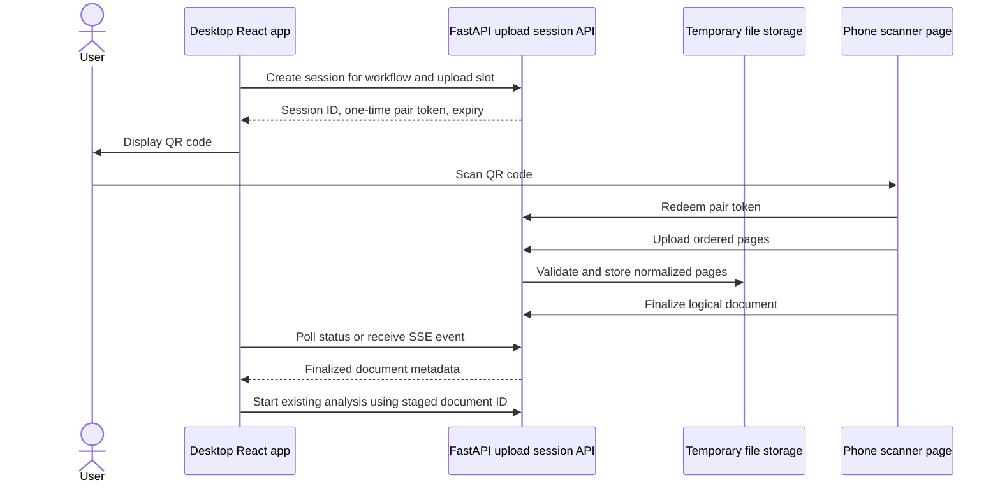

# Phone Scanning Integration Options (PENDING TO READ)

## Purpose

Exan needs a way to capture exam pages with a phone and add them to an upload slot in either:

- Exam Comparison: template, answer key, or one or more student exams.
- Grammar Evaluation: one or more documents to evaluate.

There are two distinct user experiences:

1. **Use Exan on the phone:** open the web application on the phone, scan pages, and submit there.
2. **Continue on the desktop:** leave Exan open on a computer, scan on a phone, and have the resulting document appear in the active desktop workflow.

The first experience is a small web change. The second requires pairing, transfer, document grouping, and temporary storage. It is the closer match to macOS Continuity Camera.

## Current Project Fit

| Area | Current stack | Relevance to phone scanning |
| --- | --- | --- |
| Web UI | React 19, TypeScript, Vite, Tailwind CSS, `react-dropzone` | Already produces browser `File[]` values from a shared `FileDropzone` component. |
| Web serving | nginx in Docker, Vite development server locally | Same-origin `/api` routing is useful, but phone access needs a reachable HTTPS URL rather than `localhost`. |
| Inference API | Python 3.11, FastAPI, multipart `UploadFile` endpoints | Existing uploads can be reused after capture or transfer. New pairing and staging endpoints would be needed for desktop handoff. |
| File processing | Pillow, PyMuPDF, python-docx | Exam Comparison supports PDF, JPEG, PNG, and WebP. HEIC is not supported. PDFs already represent one multi-page document. |
| Authentication | Express, JWT, MongoDB | Authentication exists, but inference upload endpoints are currently unprotected and do not consume the JWT. Pairing must not bypass ownership checks. |
| Persistence | MongoDB for users; exam state is in FastAPI process memory | Current inference state will not support durable phone/desktop sessions or multiple inference replicas. |
| Request limits | nginx `client_max_body_size 50M` | A page count, per-page limit, and total session limit will be needed for phone scans. |

### Important Current Constraints

- `FileDropzone` is the natural frontend integration point because every upload workflow already uses it.
- A template or answer key accepts one file. Several phone photos therefore need to be assembled into one logical document, normally a PDF, before using the current endpoint.
- Student exam uploads treat each file as a separate student exam. Individual page photos must not be added directly as independent files unless each photo is a complete exam.
- Grammar Evaluation currently accepts PDF and Word files, not image files. Phone pages must become a searchable PDF, pass through OCR, or be evaluated through a new vision-based path.
- iPhones may supply HEIC/HEIF images, especially when choosing existing photos. The server currently rejects those formats.
- Advanced browser camera APIs such as `getUserMedia()` require a secure context. A phone also cannot reach a service bound only to the computer's `localhost` address.
- A browser cannot invoke Apple's Continuity Camera experience through a standard cross-browser web API.

## Difficulty Scale

Difficulty is relative to the current Exan MVP and includes implementation, tests, deployment, security, and operational work.

| Rating | Meaning |
| --- | --- |
| 1 - Low | Localized frontend change; existing upload API remains intact. |
| 2 - Moderate | New capture UI or file transformation, but little infrastructure. |
| 3 - Medium | New frontend and backend contract with temporary persistence. |
| 4 - High | Real-time networking, native bridge, or new deployment concerns. |
| 5 - Very high | Multiple native platforms or unreliable low-level device transport. |

## Options Summary

| Option | Main stack | Desktop handoff | Cross-platform | Difficulty |
| --- | --- | ---: | ---: | ---: |
| 1. Mobile browser file capture | Existing React app, HTML file input | No | High | 1 |
| 2. Browser document scanner | React, `getUserMedia`, Canvas/WASM | No | High | 2 |
| 3. QR-paired web uploader | React mobile route, FastAPI sessions, storage, polling/SSE | Yes | High | 3 |
| 4. Installable PWA scanner | Option 3 plus manifest, service worker, IndexedDB | Yes | High | 3-4 |
| 5. WebRTC peer transfer | WebRTC DataChannel, signaling, STUN/TURN | Yes | Medium | 4 |
| 6. Native mobile companion | Swift/VisionKit, Kotlin/ML Kit, or React Native | Yes | High | 5 |
| 7. Electron or Tauri desktop app | Desktop wrapper plus native macOS bridge | Yes, especially on macOS | Low-medium | 4 |
| 8. Bluetooth or native nearby transfer | BLE, Multipeer Connectivity, Nearby Connections | Yes | Low | 5 |
| 9. Shared folder or AirDrop workflow | OS file sharing, optional desktop folder watcher | Partly | Medium | 1-3 |

## Option 1: Capture Through the Mobile Browser

### Option 1 operation

The user opens the existing Exan web application on the phone. The upload control offers a camera action using an input similar to:

```html
<input type="file" accept="image/*" capture="environment">
```

The captured image becomes a normal browser `File`, so the existing `FileDropzone -> File[] -> FormData -> FastAPI` path can be reused.

### Option 1 stack changes

- Extend `FileDropzone` or add a mobile-specific capture button.
- Normalize rotation and image format before upload, or normalize on FastAPI.
- Add a page review and grouping step for multi-page documents.
- Combine pages into one PDF or add a backend endpoint that accepts an ordered page group.

### Option 1 advantages

- Smallest change to the current application.
- No app store, desktop wrapper, pairing service, or Bluetooth permissions.
- Works on both iOS and Android with ordinary web deployment.
- Reuses current multipart APIs after format normalization and grouping.

### Option 1 disadvantages

- The whole workflow runs on the phone; scans do not appear in an already-open desktop browser.
- The HTML `capture` attribute is a hint, so browser behavior varies.
- A basic camera capture does not automatically provide document edge detection, perspective correction, glare warnings, or multi-page assembly.
- HEIC, orientation metadata, large images, and interrupted uploads need explicit handling.

### Option 1 difficulty

**1 - Low** for a one-photo document. **2 - Moderate** for a polished multi-page scanner.

## Option 2: Build a Browser Document Scanner

### Option 2 operation

A dedicated mobile scanner view uses `getUserMedia()` for a live camera preview. Captured frames are processed with Canvas and optionally a WebAssembly computer-vision library or commercial web scanning SDK. The user can crop, rotate, reorder, retake, and finalize pages.

### Option 2 stack choices

- Browser APIs: MediaDevices, Canvas, Blob/File, and optionally Web Workers.
- Open-source processing: OpenCV.js or a smaller purpose-built perspective-correction library.
- Commercial SDK alternatives: Scanbot Web SDK or Dynamsoft Document Scanner.
- Output: normalized JPEG pages or one generated PDF.

### Option 2 advantages

- Better document UX than a plain file input.
- Still deploys as a web application with no app store.
- Can normalize all output to JPEG or PDF before it reaches FastAPI.
- The scanner UI can later be reused by a PWA or QR-paired mobile route.

### Option 2 disadvantages

- Camera behavior, focus, memory, and performance vary across mobile browsers.
- Reliable automatic edge detection and perspective correction are significant engineering work.
- OpenCV.js adds download size and device load; commercial SDKs add licensing cost and vendor dependence.
- This option alone does not transfer a scan to an open desktop workflow.

### Option 2 difficulty

**2 - Moderate**, or **3 - Medium** for high-quality automatic document detection without a commercial SDK.

## Option 3: QR-Paired Mobile Web Uploader

### Option 3 operation

The desktop user selects **Scan with phone** in a specific upload slot. Exan creates a short-lived upload session and displays a QR code. The phone scans the QR code, opens an HTTPS mobile scanner page, captures and reviews pages, and finalizes one or more logical documents. The desktop receives the finalized documents through polling or Server-Sent Events (SSE).



### Option 3 stack changes

- React: `DocumentInput`, `PhonePairingPanel`, `MobileScannerPage`, and `DocumentQueue`.
- API client: upload-session creation, pairing, page upload, finalization, status, and deletion.
- FastAPI: short-lived upload-session endpoints and conversion into the existing processing pipeline.
- Persistence: session metadata with TTL plus temporary page/document storage.
- Desktop updates: polling first; optional SSE later.
- QR generation: a small client-side QR package.

### Option 3 advantages

- Closest cross-platform web equivalent to Continuity Camera.
- No mobile installation; any modern phone camera can participate.
- Reuses Exan's React, nginx, FastAPI, and multipart processing architecture.
- The session can preserve document boundaries, ordered pages, upload progress, and retries.
- Server mediation is easier to make reliable than direct peer-to-peer transfer.

### Option 3 disadvantages

- Requires new backend contracts, temporary persistence, cleanup, and authorization.
- Scanned exam data temporarily resides on the server.
- The application must be reachable through trusted HTTPS from both devices.
- Current in-memory inference state and unprotected inference endpoints must be improved.

### Option 3 difficulty

**3 - Medium**. This is the best balance of user experience, reliability, and fit with the current project.

## Option 4: Installable PWA Scanner

### Option 4 operation

The QR-paired mobile scanner is made installable as a Progressive Web App (PWA). A service worker caches the scanner shell, while IndexedDB stores draft page blobs and upload state for retry.

### Option 4 stack changes

- Vite PWA plugin or a manually configured manifest and service worker.
- IndexedDB, preferably behind a small wrapper such as `idb`.
- The same pairing and staging API as Option 3.
- Explicit online/offline and retry states.

### Option 4 advantages

- App-like launch and full-screen scanning without maintaining native applications.
- Draft scans can survive navigation, temporary network loss, or browser restarts.
- Builds on the recommended QR architecture instead of replacing it.
- One frontend codebase for iOS and Android.

### Option 4 disadvantages

- A PWA does not remove the need for pairing, HTTPS, or server-side document grouping.
- Mobile operating systems can suspend background uploads and enforce storage limits.
- Camera and installed-PWA capabilities still differ by browser and OS.
- Service-worker caching and update behavior add operational complexity.

### Option 4 difficulty

**3 - Medium** after Option 3 exists; **4 - High** if offline capture and robust background retry are required immediately.

## Option 5: WebRTC Peer-to-Peer Transfer

### Option 5 operation

The QR code carries pairing or signaling information. The phone and desktop establish an `RTCPeerConnection`, and image chunks travel over a WebRTC DataChannel. FastAPI still supplies signaling and may receive the file from the desktop after transfer.

### Option 5 stack changes

- React/WebRTC connection lifecycle on both devices.
- FastAPI or a separate signaling channel.
- STUN and usually TURN infrastructure for networks where direct connectivity fails.
- Chunking, backpressure, checksums, resume behavior, and page grouping.

### Option 5 advantages

- File bytes can travel directly between devices when peer connectivity succeeds.
- The server can avoid storing sensitive exam images during transfer.
- Transfer can be fast when both devices are on a favorable local network.

### Option 5 disadvantages

- QR pairing is still needed, so this does not remove the session concept.
- TURN may relay the complete upload, removing the storage/bandwidth advantage.
- Phone sleep, tab suspension, network changes, firewalls, and school Wi-Fi policies reduce reliability.
- Considerably more complex than polling or SSE, with little benefit at the current scale.

### Option 5 difficulty

**4 - High**. Consider only if server-side temporary storage is prohibited by policy.

## Option 6: Native Mobile Companion Application

### Option 6 operation

A dedicated phone app scans documents using platform document-camera APIs and uploads them into an Exan pairing session.

### Option 6 stack choices

- iOS: Swift/SwiftUI with VisionKit `VNDocumentCameraViewController`.
- Android: Kotlin with Google ML Kit Document Scanner.
- Shared UI alternative: React Native or Expo, with native modules for document scanning.
- Existing FastAPI pairing/upload API remains useful.

### Option 6 advantages

- Best scan quality and platform-native edge detection, perspective correction, rotation, and multi-page review.
- Strong control over image format, compression, metadata, offline queues, and large uploads.
- Can add notifications, managed-device policies, and deeper OS sharing later.

### Option 6 disadvantages

- Separate mobile release, signing, store review, privacy declarations, updates, analytics, and support.
- iOS and Android scanner APIs still need platform-specific integration and testing.
- React Native reduces shared UI work but does not eliminate native camera and distribution work.
- Excessive investment before scan volume and quality requirements are validated.

### Option 6 difficulty

**5 - Very high** for both mobile platforms. It becomes attractive only when browser scan quality or device-management requirements are proven blockers.

## Option 7: Electron or Tauri Desktop App with Continuity Camera

### Option 7 operation

The React frontend is packaged as a desktop application. On macOS, a native AppKit bridge integrates Apple's Continuity Camera support so a nearby iPhone can scan directly into the desktop app. Tauri would use a Rust command and custom Swift/AppKit plugin; Electron would require a native Node addon or helper process.

### Option 7 stack choices

- Tauri: current React build plus Rust and a macOS Swift/AppKit plugin.
- Electron: current React build plus Node/Electron and a native macOS bridge.
- Existing FastAPI can remain remote, run locally as a sidecar, or remain in Docker depending on the deployment model.

### Option 7 advantages

- Can produce the most macOS-like Continuity Camera experience.
- Desktop filesystem access can support watched folders, local caching, and offline/local-provider workflows.
- Tauri generally has a smaller application footprint than Electron.
- Electron has a larger desktop JavaScript ecosystem and mature packaging tooling.

### Option 7 disadvantages

- Continuity Camera integration is macOS/iPhone-specific and is not supplied automatically by Electron or Tauri webviews.
- A native bridge, code signing, notarization, updates, entitlements, and desktop support are required.
- Wrapping the webapp does not solve Android, Windows, or browser users.
- Running or locating the Python inference service becomes a desktop packaging decision of its own.

### Option 7 difficulty

**4 - High** for a macOS-only proof of concept, with additional work for a production desktop product. Choose this only if Exan is intentionally becoming a managed desktop application for other reasons as well.

## Option 8: Bluetooth or Native Nearby Transfer

### Option 8 operation

Devices discover each other locally and transfer data without a central file store. Possible technologies include Bluetooth Low Energy (BLE), Apple's Multipeer Connectivity, or Google's Nearby Connections.

### Option 8 advantages

- Can work without Internet access in a carefully controlled native environment.
- Native nearby frameworks may combine Wi-Fi peer-to-peer and Bluetooth for discovery.
- Images need not be persisted on a remote server.

### Option 8 disadvantages

- BLE is designed for small, low-bandwidth messages and is a poor transport for multi-megabyte page images.
- Web Bluetooth is not a dependable cross-browser option and is not broadly available on iOS browsers.
- Multipeer Connectivity is Apple-specific; Nearby Connections is Android-specific.
- Permissions, discovery, pairing, reconnection, chunking, integrity checks, and support are all complex.
- Raw Bluetooth would duplicate functionality that WebRTC or server-mediated HTTPS already provides more reliably.

### Option 8 difficulty

**5 - Very high**. Do not use Bluetooth as the primary image transport. If strict offline, local-only operation becomes a requirement, evaluate native peer frameworks rather than BLE characteristics.

## Option 9: Shared Folder, Cloud Drive, or AirDrop

### Option 9 operation

The phone scans to Files/iCloud Drive, Google Drive, OneDrive, AirDrop, or a network folder. The user then selects that file in Exan. A desktop wrapper could optionally watch a chosen folder and add new files automatically.

### Option 9 advantages

- Almost no Exan implementation is needed for the manual workflow.
- Uses familiar operating-system tools and existing scanner applications.
- Good temporary solution while native scanning requirements are still uncertain.
- A watched-folder enhancement can support high-volume desktop operators.

### Option 9 disadvantages

- Not an integrated handoff in the browser and may require several manual steps.
- Cloud storage can conflict with exam privacy requirements.
- Browser folder access is not consistent enough for a universal background watcher.
- Automatic watched-folder import requires a desktop wrapper or local helper.

### Option 9 difficulty

**1 - Low** as a documented manual workflow. **3 - Medium** for a robust desktop watched-folder integration.

## Recommended Architecture

### Recommendation

Use an incremental web-first approach:

1. **Add direct mobile capture and document grouping.** Make the existing application work well when opened on a phone. Normalize images to JPEG, support page review/reordering, and finalize multiple pages as one logical document.
2. **Add QR-paired, server-mediated upload sessions.** This provides the desired phone-to-desktop experience without committing to a native app or desktop wrapper.
3. **Start desktop synchronization with polling.** Polling every one or two seconds is simple, observable, and adequate for short scan sessions. Add SSE after the contract is stable if immediate updates are valuable.
4. **Add PWA capabilities only where they solve observed problems.** Installation, IndexedDB drafts, and offline retry are useful follow-ups, not prerequisites.
5. **Reassess native scanning after field testing.** Build a native phone app only if browser camera quality, offline requirements, device management, or scanning volume justify it.

Do not begin with Electron/Tauri, WebRTC, or Bluetooth. Each adds a new platform or transport before the core concepts of pairing, ownership, page grouping, and scan finalization have been validated. A desktop wrapper is reasonable later if Exan also needs local file watching, managed deployment, automatic local inference startup, or a macOS-only Continuity Camera experience.

### Proposed Logical Document Model

The frontend should stop assuming that every logical document must already be a local browser `File`:

```ts
type UploadDocument =
  | { kind: 'local'; file: File }
  | {
      kind: 'staged';
      id: string;
      name: string;
      pageCount: number;
      contentType: 'application/pdf';
    };
```

- Template and answer-key slots own one `UploadDocument` each.
- Student exam comparison and Grammar Evaluation own an ordered `UploadDocument[]`.
- A staged document owns its ordered pages; pages are never mistaken for separate student exams.
- Processing endpoints can accept either an ordinary multipart file or a staged document ID.

### Proposed API Surface

Exact names can change during implementation, but the contract should cover these operations:

| Method | Endpoint | Purpose |
| --- | --- | --- |
| `POST` | `/api/upload-sessions` | Create a session scoped to user, workflow, and upload slot. |
| `POST` | `/api/upload-sessions/{id}/pair` | Redeem the one-time phone pairing token. |
| `POST` | `/api/upload-sessions/{id}/documents` | Start a logical document. |
| `POST` | `/api/upload-sessions/{id}/documents/{documentId}/pages` | Upload one normalized page with ordering metadata. |
| `POST` | `/api/upload-sessions/{id}/documents/{documentId}/finalize` | Validate pages and create the final PDF or staged document. |
| `GET` | `/api/upload-sessions/{id}` | Poll session and finalized-document status. |
| `GET` | `/api/upload-sessions/{id}/events` | Optional later SSE stream for desktop updates. |
| `DELETE` | `/api/upload-sessions/{id}` | Cancel and delete temporary data. |

The first implementation can keep these endpoints inside the inference service because that service owns file processing. A new top-level service is not justified yet. Session metadata must be persistent or explicitly limited to one process; temporary files need a storage abstraction before horizontal scaling.

### Security and Privacy Requirements

- Use a random, one-time, short-lived pairing token. Store only its hash server-side.
- Scope the session to one authenticated user, workflow, and upload slot.
- Do not put the desktop JWT, API keys, or permanent credentials in the QR code.
- Require HTTPS and prevent pairing URLs from being logged with reusable secrets.
- Verify file signatures rather than trusting filename extensions or browser MIME values.
- Decode and re-encode images to remove malformed payloads and unnecessary EXIF metadata.
- Set per-page, per-document, page-count, and total-session limits below nginx's request ceiling.
- Expire and delete abandoned sessions and files automatically with a short TTL.
- Define whether temporary scans may use cloud object storage before deployment in schools.
- Protect inference and staged-document endpoints with the same user identity model.
- Record security events, but never log image bytes, pairing tokens, or exam content.

### Delivery Phases

| Phase | Deliverable | Primary areas affected | Exit condition |
| --- | --- | --- | --- |
| 0 | HTTPS phone access and direct camera input | React, nginx/deployment | A phone can capture one supported image and submit it. |
| 1 | Multi-page scanner and PDF/logical-document assembly | React, FastAPI file processing | Pages can be reviewed, ordered, and submitted as one exam. |
| 2 | QR pairing with polling and temporary storage | React, FastAPI, auth, persistence, nginx | A phone scan appears in the correct open desktop slot. |
| 3 | Hardening and operations | All affected services | Sessions are authorized, limited, observable, and deleted by TTL. |
| 4 | Optional PWA, SSE, or commercial scan SDK | React, nginx, FastAPI | Added only in response to measured user or quality needs. |

## Decision Matrix

Scores range from 1 (weak) to 5 (strong). A higher implementation-cost score means cheaper/easier.

| Option | Current-stack fit | User experience | Reliability | Cross-platform | Privacy control | Implementation cost |
| --- | ---: | ---: | ---: | ---: | ---: | ---: |
| Mobile browser capture | 5 | 3 | 4 | 5 | 4 | 5 |
| Browser document scanner | 5 | 4 | 3 | 4 | 4 | 4 |
| QR-paired web uploader | 5 | 5 | 5 | 5 | 4 | 3 |
| PWA scanner | 4 | 4 | 4 | 4 | 4 | 2 |
| WebRTC transfer | 3 | 4 | 2 | 3 | 5 | 2 |
| Native mobile companion | 3 | 5 | 5 | 4 | 5 | 1 |
| Desktop wrapper/Continuity | 2 | 5 on macOS | 4 | 2 | 5 | 2 |
| Bluetooth/native nearby | 1 | 3 | 2 | 1 | 5 | 1 |
| Shared folder/AirDrop | 4 | 2 | 4 | 3 | 3 | 5 |

The QR-paired web uploader has the strongest overall fit. Direct browser capture is the correct first step because its scanner and document-grouping work is reused by the paired flow.

## References

- [MDN: HTML `capture` attribute](https://developer.mozilla.org/en-US/docs/Web/HTML/Reference/Attributes/capture)
- [MDN: MediaDevices `getUserMedia()`](https://developer.mozilla.org/en-US/docs/Web/API/MediaDevices/getUserMedia)
- [MDN: Server-Sent Events](https://developer.mozilla.org/en-US/docs/Web/API/Server-sent_events)
- [MDN: WebRTC API](https://developer.mozilla.org/en-US/docs/Web/API/WebRTC_API)
- [MDN: Web Bluetooth API](https://developer.mozilla.org/en-US/docs/Web/API/Web_Bluetooth_API)
- [web.dev: Progressive Web Apps](https://web.dev/explore/progressive-web-apps)
- [Apple: Supporting Continuity Camera in a macOS app](https://developer.apple.com/documentation/appkit/supporting-continuity-camera-in-your-macos-app)
- [Apple: VisionKit document camera](https://developer.apple.com/documentation/visionkit/vndocumentcameraviewcontroller)
- [Google ML Kit: Document scanner API](https://developers.google.com/ml-kit/vision/doc-scanner)
- [Tauri documentation](https://v2.tauri.app/)
- [Electron documentation](https://www.electronjs.org/docs/latest/)
